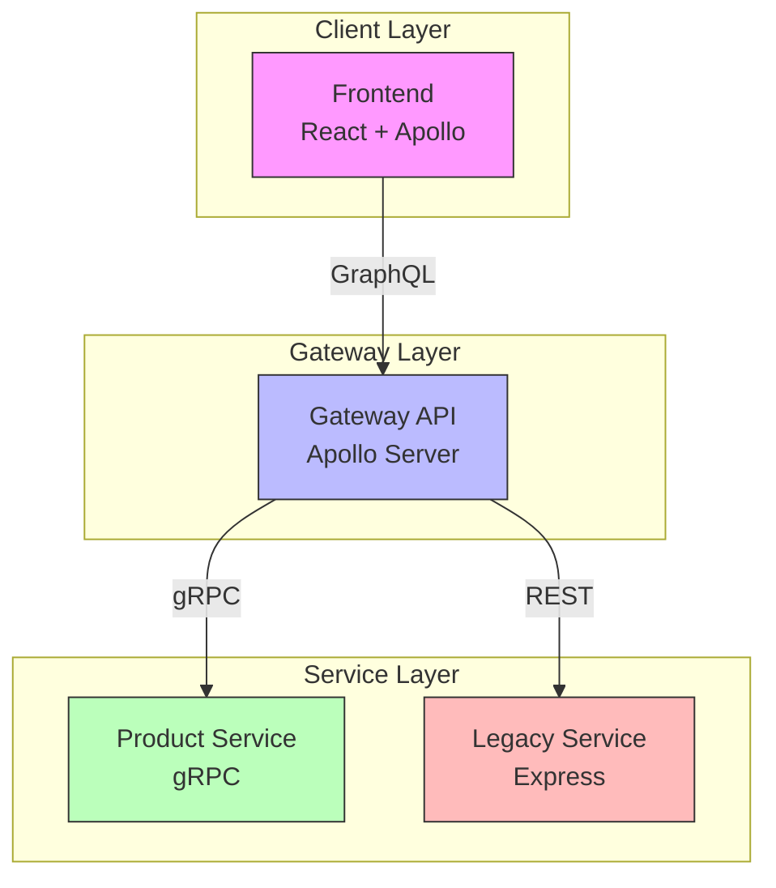

# Bridge Commerce

A microservices-based e-commerce system demonstrating integration between different service architectures.

## Architecture Overview

This project demonstrates modern microservices architecture integrating different communication protocols:



### Service Communication
- **Frontend → Gateway**: GraphQL provides a flexible, type-safe API
- **Gateway → Product Service**: gRPC enables efficient, high-performance communication
- **Gateway → Legacy Service**: REST API maintains compatibility with legacy systems

## Technologies & Patterns

### Frontend
- **React 18** with TypeScript
- **Apollo Client** for GraphQL state management
- **Tailwind CSS** for styling
- **React Query** for server state management

### Gateway API
- **Apollo Server** for GraphQL implementation
- **Express.js** as the web framework
- **TypeScript** for type safety
- Implements the Backend-for-Frontend (BFF) pattern

### Product Service (gRPC)
- **Node.js** with gRPC implementation
- **Protocol Buffers** for service definitions
- **TypeScript** for type safety
- Demonstrates modern microservice patterns

### Legacy Service (REST)
- **Express.js** REST API
- Traditional HTTP/JSON communication
- Simulates legacy system integration

## Quick Start
```bash
# Start all services
docker compose up --build

# Access services:
Frontend: http://localhost:3002
GraphQL Gateway: http://localhost:3000/graphql
Legacy API: http://localhost:3001
gRPC Service: localhost:50051
```

## Project Structure
```
bridge-commerce/
├── frontend/          # React dashboard
├── gateway-api/       # GraphQL gateway service
├── grpc-service/      # gRPC product service
├── legacy-api/        # REST order service
└── shared/           # Shared types and protocols
```

## Key Features
1. **Protocol Integration**
   - GraphQL for flexible data fetching
   - gRPC for efficient service communication
   - REST for legacy system compatibility

2. **Type Safety**
   - TypeScript across all services
   - GraphQL schema validation
   - Protocol Buffers type definitions

3. **Modern Patterns**
   - Microservices architecture
   - API Gateway pattern
   - Backend-for-Frontend pattern

## Development

### Prerequisites
- Node.js 18+
- Docker and Docker Compose
- TypeScript knowledge
- Basic understanding of GraphQL, gRPC, and REST

### Local Development
Each service can be developed independently:
```bash
# Frontend
cd frontend && npm start

# Gateway API
cd gateway-api && npm run dev

# gRPC Service
cd grpc-service && npm run dev

# Legacy API
cd legacy-api && npm start
```

